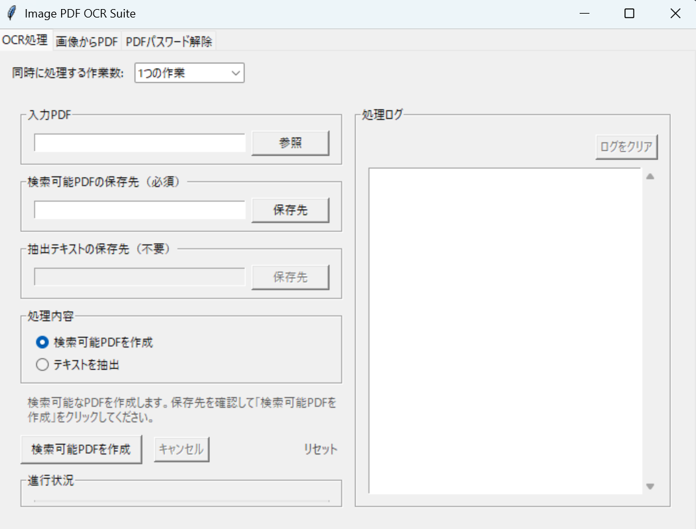

# Image PDF OCR Suite

画像ベースのPDFをOCR処理し、検索可能なPDFを生成したり、テキストを抽出したりできるPythonアプリケーションです。Tkinterを用いたデスクトップUIと、既存のCLIスクリプトのみで構成されています。

## 主な機能

- 画像ベースPDFを検索可能なPDFへ変換
- 画像ベースPDFからテキストを抽出してテキストファイルとして保存
- GUI（Tkinter）またはCLIから処理を実行可能
- パスワード保護されたPDFからパスワードを解除したPDFを作成

## ディレクトリ構成

```
image-pdf-ocr-suite/
├── image_pdf_ocr/              # OCRロジックをまとめたPythonモジュール
├── ocr_desktop_app.py          # Tkinterデスクトップアプリ
├── convert_to_searchable_pdf.py# PDF変換用CLI
├── extract_text_from_pdf.py    # テキスト抽出用CLI
└── requirements.txt
```

## 前提条件

- Python 3.10 以上
- Tesseract-OCR（日本語データを含む）
  - [UB Mannheim版インストーラー](https://github.com/UB-Mannheim/tesseract/wiki)が便利です。
  - インストール時に `Additional language data` → `Japanese` を選択し、可能であればシステムPATHへ追加してください。
  - もしコマンドラインから `tesseract -v` が実行できない場合は、環境変数 `TESSERACT_CMD` または `TESSERACT_PATH` に `tesseract.exe`（Windows）や `tesseract` バイナリ（macOS/Linux）のパスを設定してください。
  - PDF生成時に日本語の文字を埋め込むため、Noto Sans CJKなどの日本語フォントをシステムにインストールしておいてください。特定のフォントを使いたい場合は環境変数 `OCR_JPN_FONT` にフォントファイルへのパスを設定できます。

## セットアップ

```bash
python -m venv .venv
source .venv/bin/activate  # Windowsでは .venv\Scripts\activate
pip install -r requirements.txt
```

## Tkinterデスクトップアプリの利用方法

1. `python ocr_desktop_app.py` を実行します。
2. 初期表示の「OCR処理」タブでは、以下の手順でOCR変換やテキスト抽出を行えます。
   1. 「入力PDF」でOCR対象のPDFを選択します。
   2. 変換後PDFの保存先や抽出テキストの保存先を必要に応じて指定します（初期値は自動生成されます）。
   3. 「検索可能PDFを作成」または「テキストを抽出」ボタンを押すと処理が開始されます。
   4. 下部のログペインに進捗やエラーが表示され、処理完了時はダイアログでも通知されます。
3. 「PDFパスワード解除」タブでは、パスワード付きPDFのロック解除を行えます（詳しくは次節参照）。

### PDFパスワード解除タブの使い方

1. 「PDFパスワード解除」タブを開きます。
2. 「入力PDF」でパスワード保護されたPDFを選択します。
3. パスワード欄に解除対象のPDFを開くためのパスワードを入力します。
4. 必要に応じて「パスワード解除後の保存先」を変更します（初期値は `_unlocked.pdf` を付与したファイル名です）。
5. 「パスワードを解除」ボタンを押すと、解除されたPDFが指定の場所に保存されます。
   - 入力PDFと同じファイルには保存できないため、別パスを指定してください。
   - パスワードが誤っている場合や解除済みのPDFを指定した場合はエラーメッセージが表示されます。

## Windowsでのデスクトップアプリ配布手順

PyInstallerを使うと、GUIアプリを単一の`.exe`としてまとめて配布できます。以下は最小構成の例です。

1. 事前に仮想環境を作成し、このリポジトリの依存関係と `pyinstaller` をインストールします。
   ```bash
   pip install -r requirements.txt
   pip install pyinstaller
   ```
2. プロジェクトルートで次のコマンドを実行し、実行ファイルを生成します。
   ```bash
   pyinstaller ocr_desktop_app.py --onefile --noconsole --name ImagePdfOcr
   ```
   - `dist/ImagePdfOcr.exe` が生成されます。任意で `--icon` オプションを追加すればアイコンも設定できます。
3. ユーザー環境でTesseractを別途インストールせずに動かす場合は、`tesseract.exe` と `tessdata` 一式を同梱します。
   - 例: `C:\ Program Files\Tesseract-OCR` を丸ごと `dist` 配下にコピーし、`dist/Tesseract-OCR/tesseract.exe` が存在する状態にします。
   - 本アプリは実行ファイルと同じフォルダ、もしくは `Tesseract-OCR` フォルダ内の `tesseract.exe` を自動検出します。
4. `dist` フォルダをZIP化して配布すれば、他のユーザーは解凍後に `ImagePdfOcr.exe` を実行するだけで利用できます。

## CLIスクリプトの利用

### 検索可能PDFの作成

```bash
python convert_to_searchable_pdf.py --input_path "入力PDFのパス" --output_path "出力PDFのパス"
```

### テキストの抽出

```bash
python extract_text_from_pdf.py --pdf_path "入力PDFのパス" --output_path "保存するテキストファイルのパス"
```

## トラブルシューティング

- `Tesseract-OCRが見つかりません。インストールとPATH設定を確認してください。`
  - Tesseract本体が未インストール、またはインストール済みでもPATHに登録されていない場合に発生します。
  - コマンドラインから `tesseract -v` が正常に実行できるか確認してください。
  - インストール先が標準パス以外の場合は、環境変数 `TESSERACT_CMD`（または `TESSERACT_PATH`）に実行ファイルのパスを設定してください。GUI/CLIいずれの処理でもこの設定が利用されます。
  - PyInstaller版を配布する際は、`ImagePdfOcr.exe` と同じ階層、もしくは `Tesseract-OCR` フォルダ配下に `tesseract.exe` を同梱することで自動的に認識されます。
- `ページ処理中に問題が発生しました: need font file or buffer`
  - 日本語フォントが見つからない場合に表示されます。Noto Sans CJKやIPAexフォントなど日本語対応フォントをインストールし、必要に応じて `OCR_JPN_FONT` 環境変数でフォントファイルのパスを指定してください。

## OCR精度を高めるヒント

- 本アプリは `lang="jpn"` を指定してOCRを実行します。`tessdata` に日本語データが含まれていることを確認してください。
- 各ページのOCR結果から平均信頼度を算出し、既定値（65%）を下回る場合は自動的に二値化・1.5倍拡大の前処理を行って再OCRします。処理後により高い信頼度が得られた方を採用します。
- 信頼度の閾値は環境変数 `OCR_CONFIDENCE_THRESHOLD` で調整できます。数値を上げると積極的に前処理を行い、下げると前処理を抑制できます。
- 画像がぼやけていたり解像度が低い場合は、スキャン時に解像度を300dpi以上に設定する、余白を削除するなどの工夫も効果的です。

## ライセンス

本プロジェクトは [MIT License](LICENSE) の下で提供されます。

## スクリーンショット


